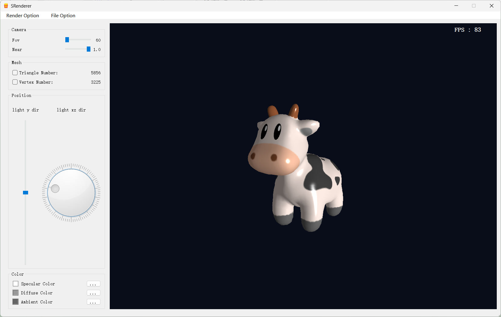
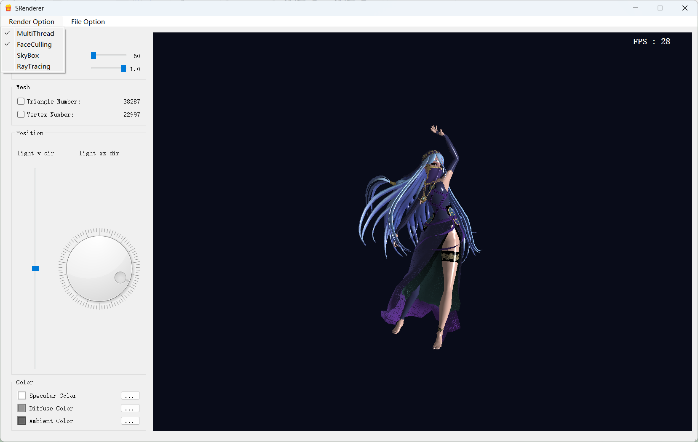
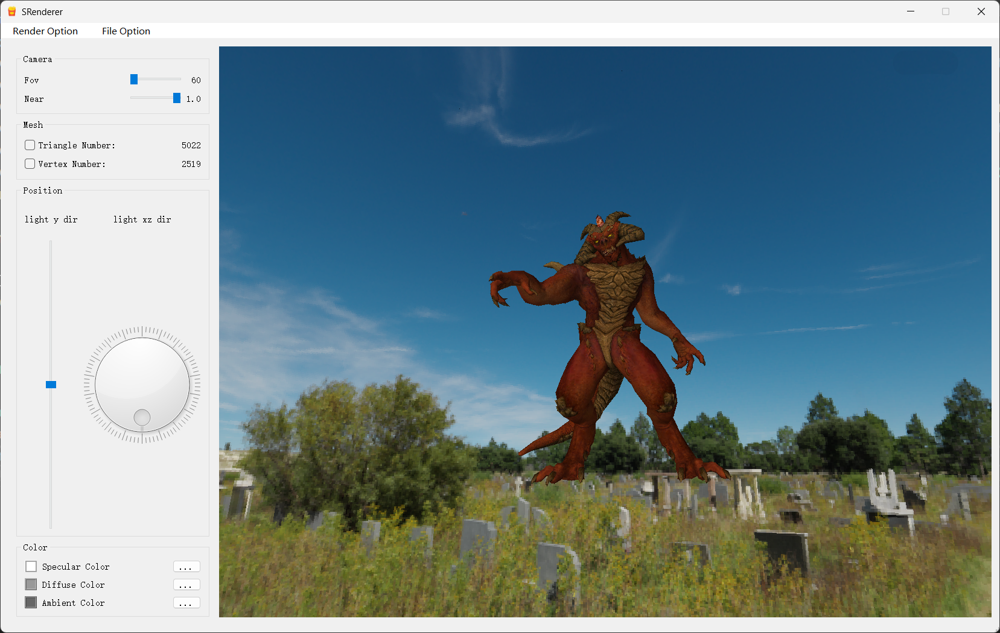
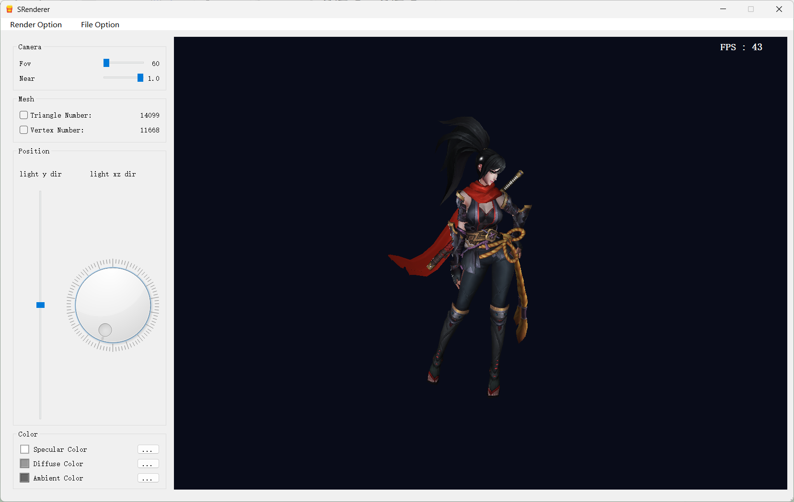
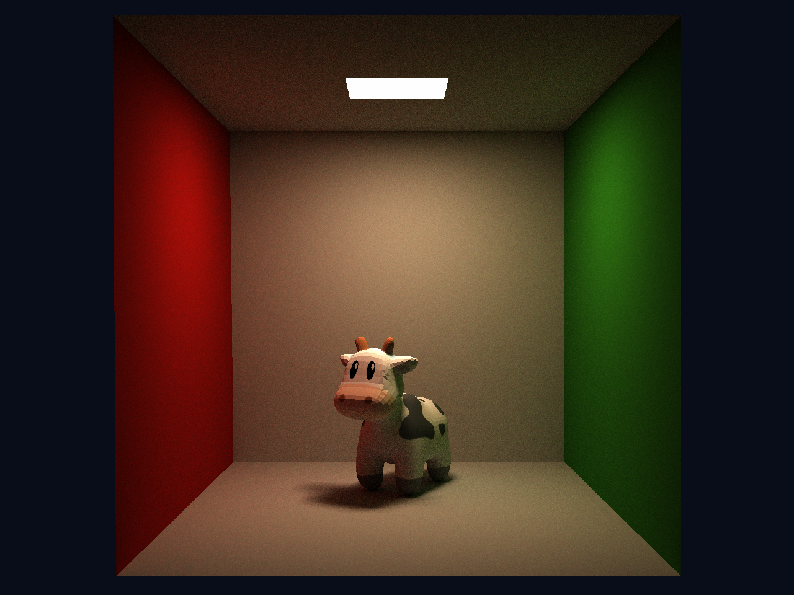
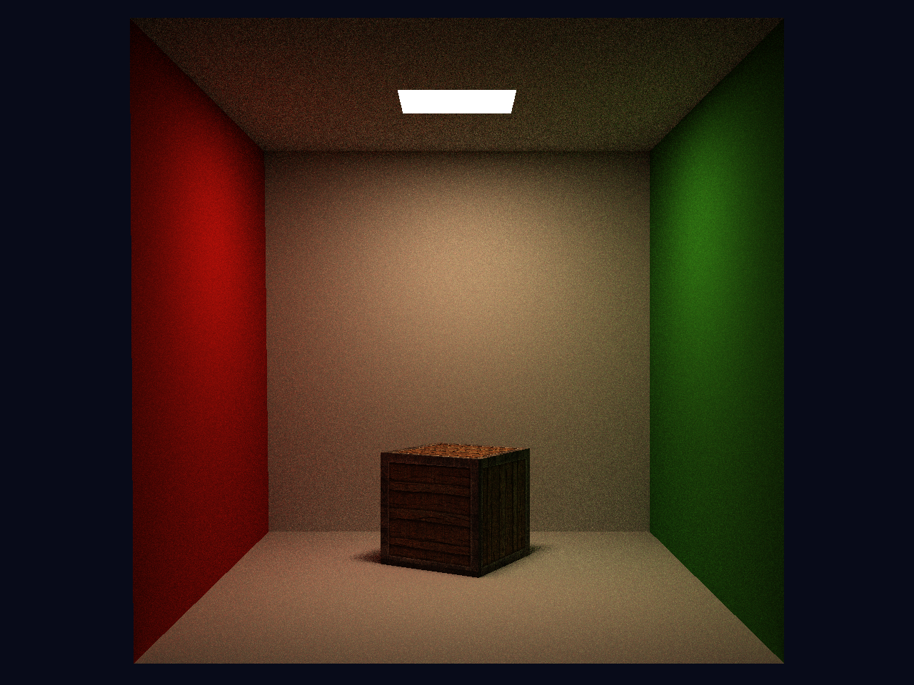
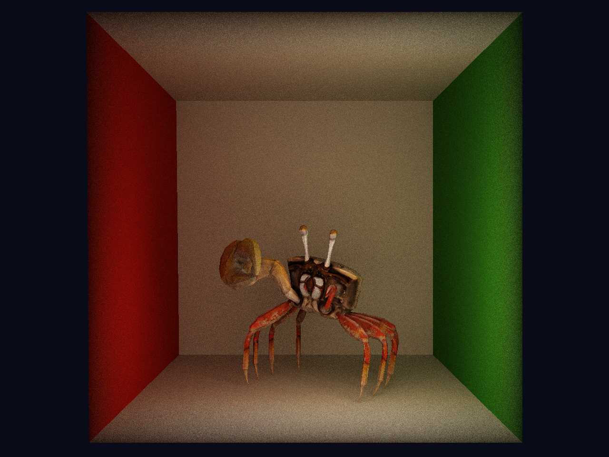

# LRender

Support importing Skybox, loading computer animations.

and supporting scene ray tracing to calculate global lighting effects.

Ray tracing can render object materials and animations.

#### reference

 **https://github.com/zauonlok/renderer** 

 **https://github.com/smile-zyk/SRenderer?tab=readme-ov-file** 

Thank you very much to the open-source authors(zauonlok and smile-zyk) for their support

#### dependency

glm(https://github.com/g-truc/glm)

